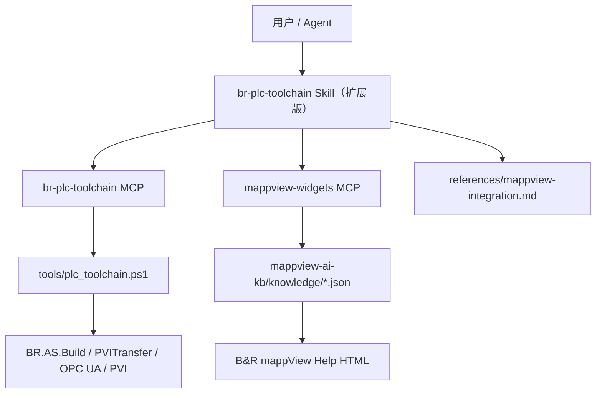

# mappview-ai-kb 融入 br-plc-toolchain 升级计划

## 文档目的

本文档定义如何将 **`mappview-ai-kb`**（mapp View 控件知识库 + MCP）融入 **`br_device_autodev/skills/br-plc-toolchain`** 工具链，供后续分阶段升级实施。

适用读者：维护 PLC 工具链的开发者、使用 Cursor/Codex Agent 的工程师。

相关文档：

- `docs/PLC_AUTOMATION_TOOLCHAIN_CONTEXT.md` — PLC 工具链整体上下文
- `docs/PLC_MCP_SKILL_PROMPT_ROADMAP.md` — MCP / Skill / Prompt 分层规划
- `skills/br-plc-toolchain/SKILL.md` — 当前 PLC Agent 操作规范
- `../mappview-ai-kb/README.md` — mappView 知识库说明（并列目录）

---

## 1. 背景与动机

### 1.1 当前状态

| 组件 | 位置 | 能力 |
|------|------|------|
| **br-plc-toolchain** | `br_device_autodev/` | 构建、下载、OPC UA/PVI 读写、IO 测试、Logger 诊断 |
| **mappview-ai-kb** | `mappview-ai-kb/`（与 `br_device_autodev` 并列） | 128 个 widget、4493 条属性索引；只读查询 Help 文档 |

`br-plc-toolchain` Skill 已声明可修改 mappView 代码，但 **Agent 缺少结构化 widget 参考**，容易在以下场景猜错：

- widget 属性名、类型、是否 `bindable`
- 枚举取值（如 `ImageAlign`）
- 复合控件子 widget（Table → TableItem 等）
- binding 中 `Target attribute` 是否合法

`PrintDemo` 工程已包含 mappView 配置与 binding 示例，例如：

- 逻辑层：`PrintDemo/Logical/mappView/`
- 物理层：`PrintDemo/Physical/<config>/mappView/`
- binding 示例：`PrintDemo/Physical/x3687x/X20CP3687X/mappView/Content_SVG.binding`

### 1.2 融合目标

建立 **PLC + HMI 一体化 Agent 工作流**：

```text
需求描述
  → 查 mappView widget 文档（mappview-ai-kb）
  → 查/改 PLC 变量与逻辑（br-plc-toolchain）
  → 修改 binding / 页面配置（工程文件）
  → 构建、下载、OPC UA 验证（br-plc-toolchain）
  → 输出统一报告
```

### 1.3 非目标（本计划不做）

- 不把 mappview-ai-kb 的 JSON 解析逻辑合并进 `tools/plc_toolchain.ps1`
- 不把 widget 查询工具并入 `tools/mcp_server/server.py` 的业务实现层
- 不实现 Phase B 的页面/布局/事件工程知识（除非单独立项）
- 不实现自动批量生成 binding XML（风险高，留待后续评估）

---

## 2. 架构原则

### 2.1 核心结论：双 MCP + Skill 合流



| 原则 | 说明 |
|------|------|
| **执行与文档分离** | `plc_*` 有副作用；`get_widget` 等只读 |
| **CLI 仍为 PLC 唯一执行底座** | 与 `PLC_MCP_SKILL_PROMPT_ROADMAP.md` 一致 |
| **Skill 负责编排** | 告诉 Agent 何时用哪套 MCP、标准顺序与安全边界 |
| **仓库可独立演进** | Help 更新只重跑 parser，不牵动 PLC 工具链 |

### 2.2 工具职责对照

| 任务 | 使用工具 | 禁止误用 |
|------|----------|----------|
| Table 有哪些 bindable 属性 | `mappview-widgets`: `get_widget("Table")` | 不要用 `plc_read_pvi` 猜属性 |
| PLC 变量是否存在 | `br-plc-toolchain`: `plc_search_variables` | 不要用 KB 推断变量名 |
| binding Source 节点运行时值 | `br-plc-toolchain`: `plc_verify_opcua` | 不要假设 widget 已刷新 |
| 枚举合法取值 | `mappview-widgets`: `get_enum` | 不要手写未验证的枚举字符串 |
| 构建并下载到 ARsim | `br-plc-toolchain`: 标准闭环 | 不要用 mappview MCP |

### 2.3 版本对齐说明

| 来源 | 版本 | 备注 |
|------|------|------|
| `mappview-ai-kb/knowledge/widget-index.json` | mapp View **6.4.0** | 静态 Help 提取 |
| `br_device_autodev` AS 工程 | **6.5.x** | 以实际工程为准 |

**规则：** widget 属性以 KB 为准作设计参考；若 6.5 行为与 KB 不一致，以 ARsim/测试 PLC 实测为准，并安排 KB 重建（见 Phase 4）。

---

## 3. 目标目录结构（融合后）

```text
codex_ws/
├── br_device_autodev/
│   ├── .vscode/mcp.json                          # 双 MCP 配置
│   ├── AGENTS.md                                 # 补充 mappview-widgets 说明
│   ├── docs/
│   │   └── MAPPVIEW_AI_KB_INTEGRATION_PLAN.md    # 本文档
│   ├── skills/
│   │   ├── br-plc-toolchain/
│   │   │   ├── SKILL.md                        # 增加 mappView 编排节
│   │   │   └── references/
│   │   │       ├── command-flow.md             # 新增流程 8、9
│   │   │       ├── mappview-integration.md       # 新建：跨界流程与示例
│   │   │       └── safety.md                   # 补充 HMI 边界
│   │   └── mappview-widgets/                     # 可选：copy/symlink Skill
│   │       └── SKILL.md
│   ├── prompts/plc_toolchain/
│   │   └── add_mappview_binding_with_verification.md  # 新建
│   └── PrintDemo/...
└── mappview-ai-kb/                               # 保持独立仓库/目录
    ├── knowledge/
    ├── mcp-server/
    ├── parser/
    └── skill/SKILL.md
```

---

## 4. 分阶段实施计划

### Phase 0：配置就位（预估 0.5 天）

**目标：** 同一 workspace 内两个 MCP Server 均可被 Cursor 加载。

#### 4.0.1 确认目录布局

推荐保持 **并列目录**（当前 `codex_ws/br_device_autodev` + `codex_ws/mappview-ai-kb`）。

备选：将 `mappview-ai-kb` 作为 `br_device_autodev/vendor/mappview-ai-kb` 子目录（适合单仓库部署，但 Help 更新耦合）。

#### 4.0.2 注册双 MCP Server

编辑 `br_device_autodev/.vscode/mcp.json`（或用户级 `~/.cursor/mcp.json`）：

```json
{
  "servers": {
    "br-plc-toolchain": {
      "type": "stdio",
      "command": "python",
      "args": ["tools/mcp_server/server.py"],
      "cwd": "${workspaceFolder}"
    },
    "mappview-widgets": {
      "type": "stdio",
      "command": "python",
      "args": ["../mappview-ai-kb/mcp-server/server.py"],
      "cwd": "${workspaceFolder}"
    }
  }
}
```

**注意：** 若 workspace 根目录是 `codex_ws` 而非 `br_device_autodev`，需调整 `cwd` 与 `args` 相对路径；也可使用绝对路径（参考 `mappview-ai-kb/cursor-mcp.example.json`）。

#### 4.0.3 安装依赖

```bash
pip install -r mappview-ai-kb/parser/requirements.txt
pip install -r mappview-ai-kb/mcp-server/requirements.txt
pip install -r br_device_autodev/tools/mcp_server/requirements.txt
```

#### 4.0.4 验收标准

| 检查项 | 命令 / 操作 | 期望结果 |
|--------|-------------|----------|
| KB CLI | `python mappview-ai-kb/mcp-server/cli.py list` | 返回 128 widgets |
| Widget 详情 | `python mappview-ai-kb/mcp-server/cli.py get Paper` | 含 properties、bindable 字段 |
| PLC MCP 启动 | `python br_device_autodev/tools/mcp_server/server.py` | 无 import 错误 |
| Cursor 加载 | 重启 Cursor，MCP 面板可见两个 server | 工具列表完整 |

#### 4.0.5 Phase 0 交付物

- [ ] 更新后的 `.vscode/mcp.json`
- [ ] 本计划文档（本文档）
- [ ] `README.md` 中增加「双 MCP 配置」小节（可选）

---

### Phase 1：Skill 层融合（预估 1 天）

**目标：** Agent 明确「何时用 mappview-widgets、何时用 br-plc-toolchain」，禁止混用与猜测。

#### 4.1.1 扩展 `skills/br-plc-toolchain/SKILL.md`

新增章节 **「mappView 控件参考（只读）」**，要点：

1. mappView 属性/事件/类型问题 → 必须用 `mappview-widgets` MCP
2. 标准顺序：`get_widget` → `get_datatype` / `get_enum` → 再改工程文件
3. 与 PLC 工具分工表（见本文档 §2.2）
4. 引用 `references/mappview-integration.md`

更新 **「何时使用」**  bullet：

- 修改 mappView 页面、binding、widget 配置
- 询问控件支持哪些 bindable 属性、事件、动作
- 设计 OPC UA ↔ widget 双向绑定

#### 4.1.2 新建 `references/mappview-integration.md`

建议目录结构：

```markdown
# mappView 与 PLC 工具链集成参考

## 1. 工具选择决策树
## 2. 标准流程：添加 binding 并验证
## 3. 本项目 binding 示例（Content_SVG.binding）
## 4. 复合 widget 速查
## 5. 类型匹配：widget 属性 ↔ PLC 变量
## 6. 常见错误与排查
## 7. 与 access_policy / 安全边界的关系
```

**Worked example（必须写入）：**

以 `Content_SVG.binding` 为例：

| 层级 | 内容 |
|------|------|
| Target | `Paper1` / `transform` |
| Source | `::SVG:astSvgPu[0].strTransform` |
| 设计阶段 | `get_widget("Paper")` 确认 `transform` bindable |
| PLC 阶段 | `plc_search_variables(module="SVG", query="strTransform")` |
| 验证阶段 | 下载后 `plc_verify_opcua` 读 Source 节点 |

#### 4.1.3 可选：安装 mappview Skill 副本

```text
br_device_autodev/skills/mappview-widgets/SKILL.md
  ← copy 或 symlink 自 mappview-ai-kb/skill/SKILL.md
```

在 `br-plc-toolchain/SKILL.md` 顶部增加：

```markdown
mappView 控件详细查询规范见：`../mappview-widgets/SKILL.md`
```

#### 4.1.4 更新 `references/safety.md`

新增 HMI 相关禁止项：

1. `mappview-widgets` MCP 永远只读，不能替代 PLC 写入
2. KB 查到的属性名 ≠ PLC 变量已存在；binding 前必须 `plc_search_variables`
3. 不自动批量修改 Safety / 生产 binding
4. KB 版本与 AS 版本可能不一致；冲突以实测为准
5. 禁止用 `plc_write_pvi` 写 HMI 配置文件

#### 4.1.5 Phase 1 交付物

- [ ] 更新 `skills/br-plc-toolchain/SKILL.md`
- [ ] 新建 `skills/br-plc-toolchain/references/mappview-integration.md`
- [ ] 更新 `skills/br-plc-toolchain/references/safety.md`
- [ ] （可选）`skills/mappview-widgets/SKILL.md`

---

### Phase 2：工作流串联（预估 1–2 天）

**目标：** 在 `command-flow.md` 中定义跨 PLC + HMI 的标准 Agent 流程。

#### 4.2.1 新增流程 8：添加 mappView binding 并 PLC 验证

写入 `skills/br-plc-toolchain/references/command-flow.md`：

```text
【设计阶段 — 只读】
1. get_widget("<WidgetName>")
   → 确认 target attribute 存在且 bindable

2. get_datatype / get_enum（按 typeRef）
   → 确认与 PLC 变量类型兼容

3. plc_search_variables(module="<Module>", query="<var>")
   → 确认 PLC 侧变量存在、读写属性符合预期

4. 阅读现有 *.binding
   → 对齐 contentRefId、widgetRefId、mode（oneWay/twoWay）

【工程修改】
5. 修改 PrintDemo/Physical/<config>/mappView/*.binding
6. （如需）修改 PrintDemo/Logical/ 下 PLC 或 Middleware 代码

【闭环验证 — 有副作用】
7. plc_build_project(config=<config>, build_ruc_package=true)
8. plc_start_arsim → probe → describe_package → check_download
9. plc_download_ruc(execute=true)
10. plc_verify_opcua
    → 读取 binding 中每个 Source refId
11. （可选）plc_read_pvi 作为备用
12. 输出报告：widget 属性摘要、binding diff、OPC UA 读数
```

**成功判定：**

- binding 中每个 Source 节点 OPC UA 可读
- 读数值与 PLC 逻辑预期一致（或符合测试 harness）

#### 4.2.2 新增流程 9：纯 HMI 文档咨询（不下 PLC）

```text
用户问题示例："LineChart 时间轴有哪些可配置属性？"

1. list_widgets(category="chart") 或 get_widget("LineChart")
2. get_widget 子控件（LineChartTimeAxis 等）
3. 结构化回答，禁止猜测

约束：不触发 build / download / write
```

#### 4.2.3 更新流程 3：添加 PLC 功能并反馈验证

在现有流程 3 中增加可选步骤：

```text
若功能涉及 HMI 显示：
  → 流程 8 的设计阶段（get_widget + plc_search_variables）
  → 完成 PLC 修改后再改 binding
  → 闭环验证包含 OPC UA 读 binding Source
```

#### 4.2.4 任务类型决策树（写入 mappview-integration.md）

```text
任务类型？
├─ 只问 widget 文档           → mappview-widgets only（流程 9）
├─ 只改 PLC 逻辑              → br-plc-toolchain only（流程 1/3/6）
├─ 改 binding / HMI 配置        → 流程 8
└─ 全栈（PLC + HMI）            → 流程 3 + 流程 8
```

#### 4.2.5 Phase 2 验收：手工走通一例

以 `Paper` + `SVG:astSvgPu[0].strTransform` 为验收用例：

| 步骤 | 工具 | 记录 |
|------|------|------|
| 1 | `get_widget("Paper")` | `transform` bindable=true |
| 2 | `plc_search_variables(module="SVG")` | 找到 `strTransform` |
| 3 | ARsim 闭环 | build + download 成功 |
| 4 | `plc_verify_opcua` | Source 节点可读 |

#### 4.2.6 Phase 2 交付物

- [ ] 更新 `references/command-flow.md`（流程 8、9）
- [ ] 完成 worked example 验收记录（可写入 `docs/` 测试报告或 README）

---

### Phase 3：Prompt 与顶层文档对齐（预估 0.5 天）

#### 4.3.1 新建 Prompt 模板

路径：`prompts/plc_toolchain/add_mappview_binding_with_verification.md`

建议结构：

```markdown
# 添加 mappView Binding 并闭环验证

## 任务描述
为 [widget] 的 [attribute] 绑定到 [PLC 变量]

## 前置（只读）
1. get_widget("[widget]")
2. plc_search_variables(...)
3. 阅读现有 binding 文件

## 修改范围
- PrintDemo/Physical/<config>/mappView/*.binding
- （可选）PrintDemo/Logical/...

## 验证
- ARsim 标准闭环
- plc_verify_opcua 读取 binding Source 节点

## 输出格式
- widget 属性表（bindable、type、default）
- binding diff
- OPC UA 读数
- pass/fail 结论
```

#### 4.3.2 更新现有 Prompt

`prompts/plc_toolchain/add_plc_feature_with_feedback.md` 增加：

> 若涉及 HMI，先执行 mappView 设计阶段（`get_widget` + `plc_search_variables`），再进入构建验证。

#### 4.3.3 更新 `AGENTS.md`

增加：

- 第二个 MCP Server：`mappview-widgets`
- 双 Skill 关系说明
- 指向本文档与 `mappview-integration.md`

#### 4.3.4 更新 `README.md`

在 MCP Server 章节后增加 **mappView 知识库** 小节：路径、启动方式、与 PLC 工具链关系。

#### 4.3.5 Phase 3 交付物

- [ ] `prompts/plc_toolchain/add_mappview_binding_with_verification.md`
- [ ] 更新 `add_plc_feature_with_feedback.md`
- [ ] 更新 `AGENTS.md`
- [ ] 更新 `README.md`

---

### Phase 4：可选增强（按需排期）

| 编号 | 增强项 | 说明 | 优先级 | 依赖 |
|------|--------|------|--------|------|
| 4.1 | **KB 版本升级** | 用 AS 6.5 Help 重跑 `parser/parse_help.py` | 高 | 本地 AS 6.5 Help 路径 |
| 4.2 | **binding 只读解析工具** | CLI/MCP：解析 `*.binding`，输出 widgetRefId ↔ OPC UA refId 对照表 | 中 | Phase 2 完成 |
| 4.3 | **统一 MCP Gateway** | 单一 `server.py` 代理两个后端，简化客户端配置 | 低 | 双 MCP 稳定运行 |
| 4.4 | **HMI 运行时 UI 验证** | browser MCP 打开 ARsim mappView URL | 低 | ARsim Web 访问路径明确 |
| 4.5 | **mappview-ai-kb Phase B** | 页面、布局、事件配置知识 | 未来 | mappview-ai-kb 项目规划 |
| 4.6 | **CI 集成** | PR 检查：binding Source 节点是否在 OPC UA 白名单/catalog 中 | 中 | access_policy 稳定 |

#### 4.4.1 KB 重建步骤（4.1 详细）

```bash
# 1. 确认 Help 源路径（示例）
# D:/BRAutomation/AS65/AS6/Help-en/Data/visualization/mappview

# 2. 重跑 parser
python mappview-ai-kb/parser/parse_help.py \
  "D:/BRAutomation/AS65/AS6/Help-en/Data/visualization/mappview" \
  "./mappview-ai-kb/knowledge"

# 3. 验证
python mappview-ai-kb/mcp-server/cli.py list
python mappview-ai-kb/mcp-server/cli.py get Paper

# 4. 更新 widget-index.json 中 version 字段文档说明
```

#### 4.4.2 binding 解析工具设计草案（4.2）

若实施，建议：

- 路径：`tools/mappview_binding_index.py`（只读，不调 PLC）
- 输入：`PrintDemo/Physical/*/mappView/*.binding`
- 输出 JSON：`contentRefId`, `widgetRefId`, `attribute`, `opcUaRefId`, `mode`
- MCP：`plc_list_bindings` 或独立 `mappview_list_bindings`（倾向后者，保持职责分离）

---

## 5. MCP 工具速查（融合后 Agent 视图）

### 5.1 br-plc-toolchain（现有，摘录）

| 工具 | 用途 |
|------|------|
| `plc_build_project` | 构建 + 可选 RUC 包 |
| `plc_download_ruc` | 下载（需 `execute=true`） |
| `plc_verify_opcua` | 读 OPC UA（验证 binding Source） |
| `plc_search_variables` | 查 PLC 变量 |
| `plc_write_pvi` | 写 PVI（测试 harness） |
| `plc_run_arsim_closed_loop` | 一键闭环 |

完整列表见 `skills/br-plc-toolchain/SKILL.md`。

### 5.2 mappview-widgets（新增引用）

| 工具 | 用途 |
|------|------|
| `list_widgets` | 按 category 浏览 widget |
| `get_widget` | 属性、动作、事件、capabilities |
| `search_properties` | 跨 widget 搜索属性 |
| `get_datatype` | 数据类型定义 |
| `get_enum` | 枚举合法值 |
| `list_categories` | widget 分类列表 |

---

## 6. 安全与边界（融合版）

| 规则 | 说明 |
|------|------|
| MCP 职责分离 | 文档查询不走 PLC 下载链路 |
| binding 修改可 diff | 每次修改应可审查、可回滚 |
| 验证优先 OPC UA | binding Source 节点是 HMI 验证的一等公民 |
| 禁止 KB 替代变量搜索 | `get_widget` 不能证明 `::Module:Var` 存在 |
| 禁止无 execute 下载 | 与现有 PLC 安全规则一致 |
| 生产目标 | 不做自动 binding 批量部署 |
| 版本冲突 | KB 6.4 vs AS 6.5 以实测为准并计划 KB 升级 |

---

## 7. 实施 Checklist（总表）

```text
Phase 0 — 配置就位
  [ ] 确认 br_device_autodev 与 mappview-ai-kb 目录布局
  [ ] 更新 .vscode/mcp.json（双 MCP）
  [ ] 安装 Python 依赖
  [ ] 验收：cli.py list / server.py 启动 / Cursor 双 MCP 可见

Phase 1 — Skill 融合
  [ ] 扩展 skills/br-plc-toolchain/SKILL.md
  [ ] 新建 references/mappview-integration.md
  [ ] 更新 references/safety.md
  [ ] （可选）安装 skills/mappview-widgets/SKILL.md

Phase 2 — 工作流串联
  [ ] command-flow.md 新增流程 8、9
  [ ] 更新流程 3（PLC + HMI）
  [ ] Paper/SVG binding 手工验收通过

Phase 3 — Prompt 与文档
  [ ] 新建 add_mappview_binding_with_verification.md
  [ ] 更新 add_plc_feature_with_feedback.md
  [ ] 更新 AGENTS.md、README.md

Phase 4 — 可选增强
  [ ] 4.1 KB 升级至 6.5 Help
  [ ] 4.2 binding 只读索引工具
  [ ] 4.3 MCP Gateway（如需）
  [ ] 4.4 UI 运行时验证（如需）
  [ ] 4.6 CI binding 检查（如需）
```

---

## 8. 风险与缓解

| 风险 | 影响 | 缓解措施 |
|------|------|----------|
| KB 6.4 vs AS 6.5 属性差异 | Agent 给出过时属性名 | Phase 4.1 重建 KB；文档注明版本 |
| 双 MCP 路径配置错误 | Cursor 无法加载 mappview | 提供 `cursor-mcp.example.json`；README 写清 cwd |
| Agent 混用工具 | 用 plc 工具猜 widget | Skill 决策树 + 禁止项 |
| binding 手改引入 XML 错误 | 运行时 HMI 异常 | 小步 diff + ARsim 闭环 + OPC UA 验证 |
| workspace 根目录不一致 | 相对路径失效 | 支持 `${workspaceFolder}` 或文档化绝对路径 |

---

## 9. 验收标准（整体完成定义）

满足以下条件可认为 **Phase 0–3 融合完成**：

1. Cursor 中 `br-plc-toolchain` 与 `mappview-widgets` 两个 MCP 均可用。
2. Agent 在 Skill 引导下能完成：**查 Paper 属性 → 搜 SVG 变量 → 说明 binding 结构 → ARsim 闭环 → OPC UA 验证**。
3. `command-flow.md` 含流程 8、9，且 `mappview-integration.md` 含 Content_SVG 示例。
4. `AGENTS.md` / `README.md` 已指向本文档。
5. 未引入 PLC 执行层与 KB 查询层的代码耦合。

---

## 10. 修订记录

| 日期 | 版本 | 说明 |
|------|------|------|
| 2026-06-18 | 1.0 | 初版：双 MCP + Skill 合流分阶段计划 |

---

## 11. 下一步建议

1. 执行 **Phase 0**（仅改 MCP 配置，零业务代码风险）。
2. 执行 **Phase 1**（Skill 与 reference 文档，Agent 行为立即改善）。
3. 用 **Content_SVG.binding + Paper widget** 做 Phase 2 验收。
4. 评估 AS 6.5 Help 是否可获取，排期 **Phase 4.1 KB 重建**。
