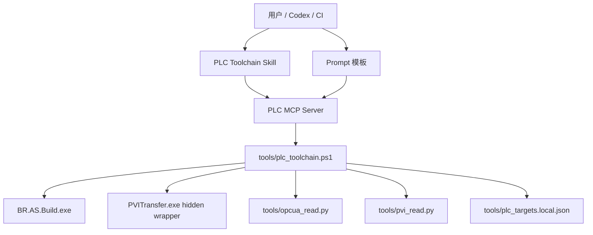

# PLC 工具链 MCP / Skill / Prompt 规划

## 目标

把当前已经验证的本地 PLC 工具链，封装成更容易被 Codex、其他 Agent、CI 和人工命令调用的分层能力：

1. 本地 CLI 继续作为唯一执行底座。
2. MCP Server 提供结构化工具接口。
3. Skill 提供 Agent 操作规范和安全边界。
4. Prompt 模板提供临时任务入口和验收报告格式。

核心原则：MCP 和 Skill 都不重新实现 PLC 逻辑；构建、下载、探针、OPC UA、PVI 仍统一走 `tools/plc_toolchain.ps1` 以及其调用的 Python/PowerShell 脚本。

## 当前底座

已存在并验证：

- `tools/plc_toolchain.ps1`
  - `Build`
  - `StartArsim`
  - `Probe`
  - `DescribePackage`
  - `CheckDownload`
  - `Download`
  - `VerifyOpcUa`
  - `ReadPvi`
- `tools/invoke_pvitransfer_silent.ps1`
- `tools/opcua_read.py`
- `tools/pvi_read.py`
- `tools/plc_targets.local.json`

已验证目标：

- ARsim：`127.0.0.1`
- 测试 PLC：`192.168.50.233`，只读探针已验证

当前安全策略：

- 下载默认只允许 ARsim 或白名单测试 PLC。
- 生产 PLC 不自动下载。
- 下载前必须 `Probe` 和 `CheckDownload`。
- OPC UA 默认白名单，不自动开放全部变量。
- PVI 读取默认白名单变量。

## 推荐分层



职责边界：

- CLI：真实执行、日志解析、安全检查、JSON 输出。
- MCP：参数校验、调用 CLI、返回结构化结果。
- Skill：告诉 Agent 什么情况下该用哪些工具，以及必须遵守哪些安全顺序。
- Prompt：给人或 Agent 一个标准任务描述入口。

## MCP Server 规划

### 技术选择

建议用 Python 实现 MCP Server：

- Windows 下调用 PowerShell 和 Python 脚本更直接。
- 可以复用现有 `tools/*.py`。
- 容易做 JSON schema、超时、日志路径整理。
- 不依赖 Node 生态，减少现场部署变量。

建议目录：

```text
tools/mcp_server/
  server.py
  toolchain.py
  schemas.py
  README_FOR_LOCAL.md
```

说明：

- `server.py`：MCP stdio 入口。
- `toolchain.py`：封装 `plc_toolchain.ps1` 调用。
- `schemas.py`：参数模型和返回结果整理。
- `README_FOR_LOCAL.md`：仅作为本地部署记录；如果后续改做 Skill，不要把冗长部署说明塞进 Skill。

### MCP 工具清单

第一批必须实现：

| MCP Tool | 对应 CLI | 用途 |
| --- | --- | --- |
| `plc_build_project` | `Build` | 构建 AS 工程，可选生成 RUC |
| `plc_start_arsim` | `StartArsim` | 启动或复用 ARsim |
| `plc_probe_target` | `Probe` | 只读读取 CPU/AR/状态 |
| `plc_describe_ruc_package` | `DescribePackage` | 读取 RUC 包元信息 |
| `plc_check_download` | `CheckDownload` | 下载前安全检查 |
| `plc_download_ruc` | `Download` | 安全检查通过后下载 |
| `plc_verify_opcua` | `VerifyOpcUa` | 读取 OPC UA 白名单节点 |
| `plc_read_pvi` | `ReadPvi` | 读取 PVI 白名单变量 |

第二批再实现：

| MCP Tool | 用途 |
| --- | --- |
| `plc_run_arsim_closed_loop` | 启动 ARsim -> 构建 -> 检查 -> 下载 -> 验证 |
| `plc_run_verification_suite` | 统一运行 OPC UA / PVI 验证并输出判定 |
| `plc_get_target_config` | 读取指定目标配置 |
| `plc_list_targets` | 列出可用目标和安全角色 |

### 参数约定

所有工具统一接收：

- `target`：默认 `arsim`，生产目标必须被拒绝。
- `project_path`：默认 `PrintDemo/Huitong_FrontEval.apj`。
- `config`：默认 `Config1`。
- `targets_path`：默认 `tools/plc_targets.local.json`。
- `timeout_seconds`：默认按命令类型设置。

下载工具额外要求：

- `execute`：必须显式为 `true` 才允许下载。
- `confirm_production`：默认 `false`。即使传入，也只用于未来人工确认流程；MVP 中仍拒绝生产下载。
- `expected_target_role`：可选，用来避免误选目标。

读取工具额外支持：

- `opcua_node_ids`：覆盖默认 OPC UA 白名单。
- `pvi_variables`：覆盖默认 PVI 白名单。

### 返回格式

MCP 统一返回 JSON：

```json
{
  "ok": true,
  "tool": "plc_probe_target",
  "target": "arsim",
  "summary": "X20CP3687X / 6.5.1 / WarmStart",
  "data": {},
  "logs": [],
  "warnings": [],
  "next_actions": []
}
```

设计要求：

- `ok=false` 时必须带 `warnings` 或错误原因。
- 原始 CLI JSON 放在 `data.raw` 或 `data` 中。
- 日志路径必须是本地绝对路径。
- 下载动作必须返回 safety check 的结果。

### 安全守卫

MCP 层必须再次检查这些规则，即使 CLI 已经检查：

1. `plc_download_ruc` 必须要求 `execute=true`。
2. 生产角色目标直接拒绝。
3. 下载前自动调用或要求已有 `plc_check_download.ok=true`。
4. 不提供“打开全部 OPC UA 变量”的工具。
5. 不提供写 PLC 变量的 MCP 工具，除非后续为测试 harness 单独设计白名单写入。
6. 所有命令都必须固定在仓库根目录运行。

## Skill 规划

### Skill 名称

建议名称：

- `br-plc-toolchain`

建议位置：

- 开发阶段可放在仓库：`skills/br-plc-toolchain/`
- 稳定后安装到：`%USERPROFILE%\.codex\skills\br-plc-toolchain\`

### Skill 内容原则

Skill 只放 Agent 必须知道的工作规范，不放大段实现细节。

`SKILL.md` 应包含：

- 什么时候使用此 Skill：
  - B&R Automation Studio 工程
  - PLC 构建、ARsim 下载、PVITransfer、OPC UA/PVI 反馈验证
  - 生成或修改 ST/C/C++ 后需要验证
- 必须先读的项目文档：
  - `docs/PLC_AUTOMATION_TOOLCHAIN_CONTEXT.md`
  - `docs/PLC_TOOLCHAIN_IMPLEMENTATION_PLAN.md`
- 操作顺序：
  - 修改代码
  - `plc_build_project`
  - `plc_probe_target`
  - `plc_describe_ruc_package`
  - `plc_check_download`
  - `plc_download_ruc`
  - `plc_verify_opcua` 或 `plc_read_pvi`
- 安全禁止项：
  - 不自动下载生产 PLC
  - 不自动修改 Safety
  - 不自动开放全部 OPC UA
  - 不绕过 CheckDownload
- 失败处理：
  - 构建失败先报告 error 摘要
  - 下载安全检查失败时停止
  - OPC UA 失败时尝试 PVI 备用读取

建议 Skill 结构：

```text
skills/br-plc-toolchain/
  SKILL.md
  references/
    safety.md
    command-flow.md
    verification.md
```

参考文件用途：

- `safety.md`：生产 PLC、Safety、OPC UA 暴露策略。
- `command-flow.md`：标准构建/下载/验证流程。
- `verification.md`：OPC UA/PVI 变量命名、白名单策略、报告格式。

不要在 Skill 里复制所有脚本内容；只引用路径和 MCP 工具名。

## Prompt 模板规划

Prompt 不作为长期逻辑，只作为可复制的任务入口。

建议目录：

```text
prompts/plc_toolchain/
  build_and_verify_arsim.md
  safe_download_check.md
  add_plc_feature_with_feedback.md
  diagnose_download_failure.md
```

### `build_and_verify_arsim.md`

用途：构建当前工程，下载到 ARsim，并做反馈验证。

模板：

```markdown
请使用 br-plc-toolchain 流程：
1. 阅读 PLC 工具链上下文文档。
2. 构建 `PrintDemo/Huitong_FrontEval.apj` 的 `Config1`，生成 RUC Package。
3. 启动或复用 `arsim`。
4. 探针读取目标状态。
5. 描述 RUC 包并执行下载安全检查。
6. 仅当安全检查通过时下载到 ARsim。
7. 下载后优先 OPC UA 验证，失败时用 PVI 读取备用验证变量。
8. 输出构建、下载、验证摘要和日志路径。
```

### `safe_download_check.md`

用途：只做下载前检查，不执行下载。

模板：

```markdown
请只执行 PLC 下载前安全检查，不执行下载：
目标：{target}
项目：`PrintDemo/Huitong_FrontEval.apj`
配置：`Config1`

需要输出：
- 目标 CPU/AR/状态
- RUC 包 CPU/Runtime/AR
- 是否允许下载
- 如果拒绝，列出原因
```

### `add_plc_feature_with_feedback.md`

用途：修改 PLC 代码后闭环验证。

模板：

```markdown
请为当前 B&R AS 工程实现以下 PLC 功能：
{feature_request}

要求：
- 修改前阅读工具链上下文文档。
- 完成后构建。
- 优先下载到 ARsim 验证。
- 使用 OPC UA/PVI 读取反馈变量。
- 输出 diff 摘要、构建摘要、验证摘要。
- 不下载生产 PLC，不修改 Safety 工程。
```

### `diagnose_download_failure.md`

用途：下载失败诊断。

模板：

```markdown
请诊断 PLC 下载失败：
- 读取最近的 PVITransfer 日志。
- 重新执行 Probe。
- 描述 RUC 包。
- 对比目标和包信息。
- 给出最可能原因和下一步修复建议。
- 不执行下载。
```

## 实施里程碑

### M1：统一 CLI JSON 和错误码（已完成）

目标：

- 每个 `plc_toolchain.ps1` 核心命令都输出稳定 JSON。
- 失败时 exit code 和 JSON `ok=false` 一致。
- 构建输出中的长日志保存到文件，控制台只输出 JSON 摘要。

验收：

- `Build`、`Probe`、`CheckDownload`、`VerifyOpcUa`、`ReadPvi` 都可被 MCP 无歧义解析。

已完成内容：

- `Build` 不再向 stdout 输出完整 Automation Studio 日志；日志写入 `tools/.generated/build_Config1.log`。
- `Probe` 不再向 stdout 输出 PVITransfer 日志；日志写入 `tools/.generated/probe_<target>.log`。
- `CheckDownload` 失败时返回 JSON，并以非零 exit code 退出。
- `VerifyOpcUa` 和 `ReadPvi` 由 PowerShell 统一捕获 Python JSON，并补充 `process_exit_code`、临时变量文件路径等字段。
- 顶层异常统一返回 `{ ok=false, command, error, target }` JSON。

### M2：实现 MCP Server MVP（进行中，3 个最小工具已完成）

目标：

- 实现第一批 8 个 MCP 工具。
- 能从 MCP 调用 ARsim 闭环。

当前已完成的最小工具：

- `plc_probe_target`
- `plc_read_pvi`
- `plc_check_download`

实现位置：

- `tools/mcp_server/server.py`
- `tools/mcp_server/toolchain.py`
- `tools/mcp_server/schemas.py`

验收：

- `plc_probe_target(target="arsim")` 返回 CPU/AR/状态。（已通过）
- `plc_check_download(target="arsim")` 返回 `ok=true`。（已通过）
- `plc_read_pvi(target="arsim")` 返回当前验证变量。（已通过）
- `plc_check_download(target="test_plc")` 返回 `ok=false` 和拒绝原因，但 JSON-RPC 调用本身正常返回。（已通过）
- `plc_download_ruc(target="arsim", execute=true)` 能下载并返回验证摘要。

### M3：创建 Skill

目标：

- 创建 `br-plc-toolchain` Skill。
- Skill 使用简洁触发描述和短流程。
- 详细规则放在 `references/`。

验收：

- 新会话中 Agent 能根据 Skill 正确选择 MCP 工具。
- Agent 不会跳过下载安全检查。
- Agent 不会默认打开全部 OPC UA。

### M4：Prompt 模板

目标：

- 建立可复制的标准提示词。
- 区分只读检查、ARsim 闭环、功能修改、失败诊断。

验收：

- 每个 prompt 都能直接触发对应 MCP/Skill 流程。
- Prompt 不包含易过期路径以外的实现细节。

### M5：统一验证报告

目标：

- 输出 `tools/.generated/reports/*.json`。
- 报告同时包含构建、包信息、目标信息、下载日志、OPC UA/PVI 读数。

验收：

- 一次 ARsim 闭环后生成单个 JSON 报告。
- 报告可用于 CI 判断 pass/fail。

## 推荐下一步执行顺序

1. 先改造 `tools/plc_toolchain.ps1`，让所有命令 JSON 更稳定。
2. 新建 `tools/mcp_server/`，实现 `plc_probe_target` 和 `plc_read_pvi` 两个最小工具。
3. 接入 `plc_check_download`、`plc_download_ruc`。
4. 做一次 ARsim 闭环 MCP 调用验证。
5. 创建 `skills/br-plc-toolchain/`。
6. 创建 `prompts/plc_toolchain/`。
7. 补统一验证报告。

## 待决策点

1. MCP Server 是否只在本机 Codex 使用，还是需要给团队其他机器部署。
2. Skill 是放仓库内随项目版本管理，还是安装到个人 Codex skills 目录。
3. 是否允许 MCP 提供白名单变量写入能力，用于自动测试输入。
4. 测试 PLC `192.168.50.233` 后续是否要加入真实下载闭环；如果要，需要生成匹配 `X20CP1586 / J4.93` 的 RUC 包。
5. OPC UA 自动修改配置是否只做“生成建议 diff”，不自动应用。

## 风险

- PVI / PVITransfer 依赖本机 B&R 安装和许可状态，MCP 需要把此类错误转成清晰报告。
- Automation Studio 构建工具可能返回非零 exit code，但日志显示 0 error，因此必须继续按日志错误数判定。
- ARsim 包与真实 PLC 包不能混用。
- OPC UA 全量开放变量有客户设备安全风险，必须保持默认关闭。
- PowerShell 数组参数容易被调用方传错，MCP 应负责把数组写入临时 JSON 文件再调用 CLI。
