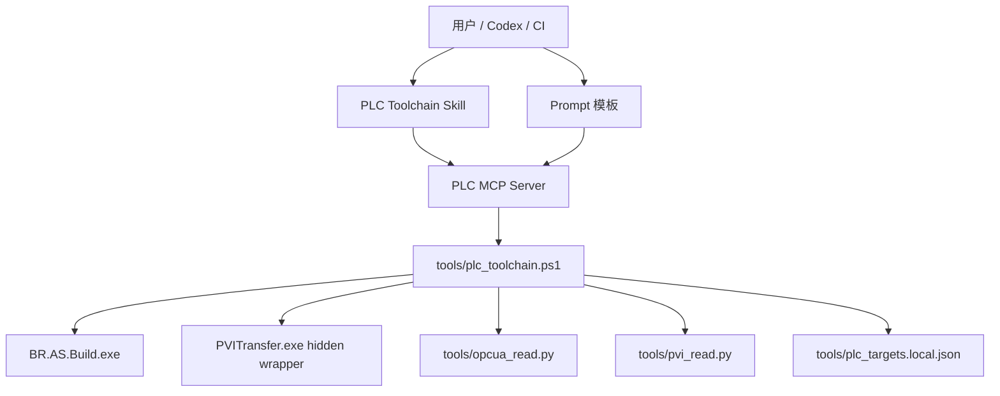

# PLC 工具链 MCP / Skill / Prompt 规划

## 目标

把当前已经验证的本地 PLC 工具链，封装成更容易被 Codex、其他 Agent、CI 和人工命令调用的分层能力：

1. 本地 CLI 继续作为唯一执行底座。
2. MCP Server 提供结构化工具接口。
3. Skill 提供 Agent 操作规范和安全边界。
4. Prompt 模板提供临时任务入口和验收报告格式。

核心原则：MCP 和 Skill 都不重新实现 PLC 逻辑；构建、下载、探针、OPC UA、PVI 仍统一走 `tools/plc_toolchain.ps1` 以及其调用的 Python/PowerShell 脚本。

## 当前底座

已存在并验证：

- `tools/plc_toolchain.ps1`
  - `Build`
  - `StartArsim`
  - `Probe`
  - `DescribePackage`
  - `CheckDownload`
  - `Download`
  - `VerifyOpcUa`
  - `ReadPvi`
- `tools/invoke_pvitransfer_silent.ps1`
- `tools/opcua_read.py`
- `tools/pvi_read.py`
- `tools/plc_targets.local.json`

已验证目标：

- ARsim：`127.0.0.1`
- 测试 PLC：`192.168.50.233`，只读探针已验证

当前安全策略：

- 下载默认只允许 ARsim 或白名单测试 PLC。
- 生产 PLC 不自动下载。
- 下载前必须 `Probe` 和 `CheckDownload`。
- OPC UA 默认白名单，不自动开放全部变量。
- PVI 读取默认白名单变量。

## 推荐分层



职责边界：

- CLI：真实执行、日志解析、安全检查、JSON 输出。
- MCP：参数校验、调用 CLI、返回结构化结果。
- Skill：告诉 Agent 什么情况下该用哪些工具，以及必须遵守哪些安全顺序。
- Prompt：给人或 Agent 一个标准任务描述入口。

## MCP Server 规划

### 技术选择

建议用 Python 实现 MCP Server：

- Windows 下调用 PowerShell 和 Python 脚本更直接。
- 可以复用现有 `tools/*.py`。
- 容易做 JSON schema、超时、日志路径整理。
- 不依赖 Node 生态，减少现场部署变量。

建议目录：

```text
tools/mcp_server/
  server.py
  toolchain.py
  schemas.py
  README_FOR_LOCAL.md
```

说明：

- `server.py`：MCP stdio 入口。
- `toolchain.py`：封装 `plc_toolchain.ps1` 调用。
- `schemas.py`：参数模型和返回结果整理。
- `README_FOR_LOCAL.md`：仅作为本地部署记录；如果后续改做 Skill，不要把冗长部署说明塞进 Skill。

### MCP 工具清单

第一批必须实现：

| MCP Tool | 对应 CLI | 用途 |
| --- | --- | --- |
| `plc_build_project` | `Build` | 构建 AS 工程，可选生成 RUC |
| `plc_start_arsim` | `StartArsim` | 启动或复用 ARsim |
| `plc_probe_target` | `Probe` | 只读读取 CPU/AR/状态 |
| `plc_describe_ruc_package` | `DescribePackage` | 读取 RUC 包元信息 |
| `plc_check_download` | `CheckDownload` | 下载前安全检查 |
| `plc_download_ruc` | `Download` | 安全检查通过后下载 |
| `plc_verify_opcua` | `VerifyOpcUa` | 读取 OPC UA 白名单节点 |
| `plc_read_pvi` | `ReadPvi` | 读取 PVI 白名单变量 |

第二批已实现：

| MCP Tool | 用途 |
| --- | --- |
| `plc_run_arsim_closed_loop` | 启动 ARsim -> 构建 -> 检查 -> 下载 -> 验证 |
| `plc_run_verification_suite` | 统一运行 OPC UA / PVI 验证并输出判定 |
| `plc_get_target_config` | 读取指定目标配置 |
| `plc_list_targets` | 列出可用目标和安全角色 |

第三批建议实现：输入输出测试能力（M6）：

| MCP Tool | 用途 | 安全门 |
| --- | --- | --- |
| `plc_write_pvi` | 只对白名单测试变量执行 PVI 写入 | 必须 `execute=true`，禁止生产目标 |
| `plc_run_io_test_case` | 执行单个输入 -> 等待 -> 输出读取 -> 断言测试 | 写入变量必须在白名单 |
| `plc_run_test_suite` | 批量执行 JSON 测试套件并生成汇总报告 | 每条 case 独立记录 pass/fail |
| `plc_reset_test_harness` | 将测试 harness 变量恢复到安全状态 | 只写 reset 白名单变量 |

第四批已实现：Logger 只读诊断能力（M7）：

| MCP Tool | 用途 | 安全门 |
| --- | --- | --- |
| `plc_read_logger` | 通过 PVITransfer `Logger` 命令读取 PLC/AR logger 模块，输出 html/csvx/arl/logpkg | 只读；模块必须在 `logger.allowed_modules` 白名单；默认禁用 Safety |

### 参数约定

所有工具统一接收：

- `target`：默认 `arsim`，生产目标必须被拒绝。
- `project_path`：默认 `PrintDemo/Huitong_FrontEval.apj`。
- `config`：默认 `Config1`。
- `targets_path`：默认 `tools/plc_targets.local.json`。
- `timeout_seconds`：默认按命令类型设置。

下载工具额外要求：

- `execute`：必须显式为 `true` 才允许下载。
- `confirm_production`：默认 `false`。即使传入，也只用于未来人工确认流程；MVP 中仍拒绝生产下载。
- `expected_target_role`：可选，用来避免误选目标。

读取工具额外支持：

- `opcua_node_ids`：覆盖默认 OPC UA 白名单。
- `pvi_variables`：覆盖默认 PVI 白名单。

输入输出测试工具额外支持：

- `writes`：测试输入写入列表，仅允许 `pvi.write_whitelist` 中的变量。
- `readback`：写入后读取的输出变量列表，默认使用 `pvi.read_whitelist` 或测试用例指定变量。
- `expected`：期望值、容差和比较方式。
- `settle_ms`：写入后等待 PLC 周期执行的时间。
- `restore`：测试完成后的恢复动作，默认启用。

Logger 读取工具额外支持：

- `logger_type`：Logger module type，例如 `System`、`User`、`Connectivity`。
- `logger_name`：Logger module name，例如 `$arlogsys`、`$arlogusr`、`$arlogconn`。
- `format`：输出格式，建议首批支持 `.html`、`.csvx`、`.arl`、`.logpkg`。
- `output_path`：可选输出路径，默认写入 `tools/.generated/logger/`。
- `include_summary`：可选，后续用于解析 `.csvx` 并返回结构化摘要。

### 返回格式

MCP 统一返回 JSON：

```json
{
  "ok": true,
  "tool": "plc_probe_target",
  "target": "arsim",
  "summary": "X20CP3687X / 6.5.1 / WarmStart",
  "data": {},
  "logs": [],
  "warnings": [],
  "next_actions": []
}
```

设计要求：

- `ok=false` 时必须带 `warnings` 或错误原因。
- 原始 CLI JSON 放在 `data.raw` 或 `data` 中。
- 日志路径必须是本地绝对路径。
- 下载动作必须返回 safety check 的结果。

### 安全守卫

MCP 层必须再次检查这些规则，即使 CLI 已经检查：

1. `plc_download_ruc` 必须要求 `execute=true`。
2. 生产角色目标直接拒绝。
3. 下载前自动调用或要求已有 `plc_check_download.ok=true`。
4. 不提供“打开全部 OPC UA 变量”的工具。
5. 不提供写 PLC 变量的 MCP 工具，除非后续为测试 harness 单独设计白名单写入。
6. 所有命令都必须固定在仓库根目录运行。

M6 写入测试守卫：

1. `plc_write_pvi` 必须要求 `execute=true`。
2. 只允许写 `tools/plc_targets.local.json` 中 `pvi.write_whitelist` 的变量。
3. 禁止写物理 I/O、Safety、系统变量、未列入测试 harness 的业务变量。
4. `role=production` 直接拒绝写入测试。
5. 每次写入前后必须记录 readback 和报告路径。
6. 测试结束必须执行 restore/reset，失败时也要尝试恢复安全状态。

M7 Logger 读取守卫：

1. `plc_read_logger` 只读，不提供清空、删除、修改 Logger 的能力。
2. 只允许读取 `tools/plc_targets.local.json` 中 `logger.allowed_modules` 的模块。
3. Safety logger 默认禁用；如未来需要，必须单独设计显式确认和审计流程。
4. 生产目标默认不自动读取；如需现场诊断，应先明确目标角色和授权方式。
5. 输出文件默认写入 `tools/.generated/logger/`，并在 JSON 返回值中记录路径。

## Skill 规划

### Skill 名称

建议名称：

- `br-plc-toolchain`

建议位置：

- 开发阶段可放在仓库：`skills/br-plc-toolchain/`
- 稳定后安装到：`%USERPROFILE%\.codex\skills\br-plc-toolchain\`

### Skill 内容原则

Skill 只放 Agent 必须知道的工作规范，不放大段实现细节。

`SKILL.md` 应包含：

- 什么时候使用此 Skill：
  - B&R Automation Studio 工程
  - PLC 构建、ARsim 下载、PVITransfer、OPC UA/PVI 反馈验证
  - 生成或修改 ST/C/C++ 后需要验证
- 必须先读的项目文档：
  - `docs/PLC_AUTOMATION_TOOLCHAIN_CONTEXT.md`
  - `docs/PLC_TOOLCHAIN_IMPLEMENTATION_PLAN.md`
- 操作顺序：
  - 修改代码
  - `plc_build_project`
  - `plc_probe_target`
  - `plc_describe_ruc_package`
  - `plc_check_download`
  - `plc_download_ruc`
  - `plc_verify_opcua` 或 `plc_read_pvi`
- 安全禁止项：
  - 不自动下载生产 PLC
  - 不自动修改 Safety
  - 不自动开放全部 OPC UA
  - 不绕过 CheckDownload
- 失败处理：
  - 构建失败先报告 error 摘要
  - 下载安全检查失败时停止
  - OPC UA 失败时尝试 PVI 备用读取

建议 Skill 结构：

```text
skills/br-plc-toolchain/
  SKILL.md
  references/
    safety.md
    command-flow.md
    verification.md
```

参考文件用途：

- `safety.md`：生产 PLC、Safety、OPC UA 暴露策略。
- `command-flow.md`：标准构建/下载/验证流程。
- `verification.md`：OPC UA/PVI 变量命名、白名单策略、报告格式。

不要在 Skill 里复制所有脚本内容；只引用路径和 MCP 工具名。

## Prompt 模板规划

Prompt 不作为长期逻辑，只作为可复制的任务入口。

建议目录：

```text
prompts/plc_toolchain/
  build_and_verify_arsim.md
  safe_download_check.md
  add_plc_feature_with_feedback.md
  diagnose_download_failure.md
```

### `build_and_verify_arsim.md`

用途：构建当前工程，下载到 ARsim，并做反馈验证。

模板：

```markdown
请使用 br-plc-toolchain 流程：
1. 阅读 PLC 工具链上下文文档。
2. 构建 `PrintDemo/Huitong_FrontEval.apj` 的 `Config1`，生成 RUC Package。
3. 启动或复用 `arsim`。
4. 探针读取目标状态。
5. 描述 RUC 包并执行下载安全检查。
6. 仅当安全检查通过时下载到 ARsim。
7. 下载后优先 OPC UA 验证，失败时用 PVI 读取备用验证变量。
8. 输出构建、下载、验证摘要和日志路径。
```

### `safe_download_check.md`

用途：只做下载前检查，不执行下载。

模板：

```markdown
请只执行 PLC 下载前安全检查，不执行下载：
目标：{target}
项目：`PrintDemo/Huitong_FrontEval.apj`
配置：`Config1`

需要输出：
- 目标 CPU/AR/状态
- RUC 包 CPU/Runtime/AR
- 是否允许下载
- 如果拒绝，列出原因
```

### `add_plc_feature_with_feedback.md`

用途：修改 PLC 代码后闭环验证。

模板：

```markdown
请为当前 B&R AS 工程实现以下 PLC 功能：
{feature_request}

要求：
- 修改前阅读工具链上下文文档。
- 完成后构建。
- 优先下载到 ARsim 验证。
- 使用 OPC UA/PVI 读取反馈变量。
- 输出 diff 摘要、构建摘要、验证摘要。
- 不下载生产 PLC，不修改 Safety 工程。
```

### `diagnose_download_failure.md`

用途：下载失败诊断。

模板：

```markdown
请诊断 PLC 下载失败：
- 读取最近的 PVITransfer 日志。
- 重新执行 Probe。
- 描述 RUC 包。
- 对比目标和包信息。
- 给出最可能原因和下一步修复建议。
- 不执行下载。
```

## 实施里程碑

### M1：统一 CLI JSON 和错误码（已完成）

目标：

- 每个 `plc_toolchain.ps1` 核心命令都输出稳定 JSON。
- 失败时 exit code 和 JSON `ok=false` 一致。
- 构建输出中的长日志保存到文件，控制台只输出 JSON 摘要。

验收：

- `Build`、`Probe`、`CheckDownload`、`VerifyOpcUa`、`ReadPvi` 都可被 MCP 无歧义解析。

已完成内容：

- `Build` 不再向 stdout 输出完整 Automation Studio 日志；日志写入 `tools/.generated/build_Config1.log`。
- `Probe` 不再向 stdout 输出 PVITransfer 日志；日志写入 `tools/.generated/probe_<target>.log`。
- `CheckDownload` 失败时返回 JSON，并以非零 exit code 退出。
- `VerifyOpcUa` 和 `ReadPvi` 由 PowerShell 统一捕获 Python JSON，并补充 `process_exit_code`、临时变量文件路径等字段。
- 顶层异常统一返回 `{ ok=false, command, error, target }` JSON。

### M2：实现 MCP Server MVP（已完成，全部 8 个工具已实现）

目标：

- 实现第一批 8 个 MCP 工具。
- 能从 MCP 调用 ARsim 闭环。

已完成内容：

- `plc_build_project`
- `plc_start_arsim`
- `plc_probe_target`
- `plc_describe_ruc_package`
- `plc_check_download`
- `plc_download_ruc`
- `plc_verify_opcua`
- `plc_read_pvi`

实现位置：

- `tools/mcp_server/server.py` — stdio JSON-RPC 入口
- `tools/mcp_server/toolchain.py` — CLI 调用封装、结果整理、安全检查
- `tools/mcp_server/schemas.py` — 工具参数 schema 定义

验收（全部已通过 2026-05-22 测试）：

- `plc_build_project(target="arsim")` 构建成功，返回 0 error(s), 2 warning(s)。（已通过）
- `plc_start_arsim(target="arsim")` 复用或启动 ARsim 实例。（已通过）
- `plc_probe_target(target="arsim")` 返回 CPU/AR/状态。（已通过）
- `plc_describe_ruc_package(target="arsim")` 返回包元信息 AR000 / 6.5.1。（已通过）
- `plc_check_download(target="arsim")` 返回 `ok=true`。（已通过）
- `plc_download_ruc(target="arsim")` 不带 execute 时安全门拒绝。（已通过）
- `plc_verify_opcua(target="arsim")` 读取 6/6 OPC UA 节点。（已通过）
- `plc_read_pvi(target="arsim")` 读取 4/4 PVI 变量。（已通过）

### M3：创建 Skill（已完成）

目标：

- 创建 `br-plc-toolchain` Skill。
- Skill 使用简洁触发描述和短流程。
- 详细规则放在 `references/`。

已完成内容：

- `skills/br-plc-toolchain/SKILL.md` — 触发条件、MCP 工具速查表、标准操作顺序、安全禁止项、失败处理
- `skills/br-plc-toolchain/references/safety.md` — 目标分类权限表、下载五步检查清单、生产/Safety/OPC UA/PVI 安全规则、构建结果判断、日志审计
- `skills/br-plc-toolchain/references/command-flow.md` — 5 种标准流程：ARsim 闭环验证、仅安全检查、功能修改反馈、下载失败诊断、测试 PLC 只读验证
- `skills/br-plc-toolchain/references/verification.md` — OPC UA 6 个白名单节点详情、PVI 4 个白名单变量详情、验证策略、报告格式

验收：

- Skill 文件包含完整 MCP 工具速查表和参数说明。（已满足）
- SKILL.md 明确列出 6 条安全禁止项。（已满足）
- references/safety.md 详细定义下载前五步检查清单。（已满足）
- command-flow.md 覆盖 5 种标准操作流程及失败处置。（已满足）

### M4：Prompt 模板（已完成）

目标：

- 建立可复制的标准提示词。
- 区分只读检查、ARsim 闭环、功能修改、失败诊断。

验收：

- 每个 prompt 都能直接触发对应 MCP/Skill 流程。
- Prompt 不包含易过期路径以外的实现细节。

已完成内容：

- `prompts/plc_toolchain/build_and_verify_arsim.md`
- `prompts/plc_toolchain/safe_download_check.md`
- `prompts/plc_toolchain/add_plc_feature_with_feedback.md`
- `prompts/plc_toolchain/diagnose_download_failure.md`

### M5：统一验证报告（已完成）

目标：

- 输出 `tools/.generated/reports/*.json`。
- 报告同时包含构建、包信息、目标信息、下载日志、OPC UA/PVI 读数。

验收：

- 一次 ARsim 闭环后生成单个 JSON 报告。
- 报告可用于 CI 判断 pass/fail。

已完成内容：

- `RunVerificationSuite` 输出 `tools/.generated/reports/*_verification_<target>.json`。
- `RunArsimClosedLoop` 输出 `tools/.generated/reports/*_closed_loop_<target>.json`。
- MCP 已暴露 `plc_run_verification_suite` 和 `plc_run_arsim_closed_loop`。
- 报告包含构建、包信息、目标探针、下载检查、下载结果和 OPC UA/PVI 验证结果。

### M6：输入输出测试闭环（待做）

目标：

- 从“变量可读”升级到“输入输出行为可验证”。
- 支持 LQR 等控制算法的输入、输出和容差断言。
- 通过 PVI 对白名单测试变量写入输入，再读取输出并自动判定 pass/fail。
- 输出 `tools/.generated/reports/*_io_test_<suite>.json`。

建议新增本地文件：

```text
tools/
  pvi_write.py
  plc_io_test_runner.py

tests/plc/
  lqr_io_tests.json
```

建议 `tools/plc_targets.local.json` 扩展：

```json
{
  "pvi": {
    "read_whitelist": [],
    "write_whitelist": [
      { "scope": "task", "task": "LQR", "name": "bLqrEnable", "type": "BOOL" },
      { "scope": "task", "task": "LQR", "name": "bLqrReset", "type": "BOOL" },
      { "scope": "task", "task": "LQR", "name": "arLqrX", "type": "REAL[4]" },
      { "scope": "task", "task": "LQR", "name": "arLqrXRef", "type": "REAL[4]" },
      { "scope": "task", "task": "LQR", "name": "arLqrK", "type": "REAL[8]" },
      { "scope": "task", "task": "LQR", "name": "rLqrMaxAbsU", "type": "REAL" }
    ],
    "restore_writes": [
      { "variable": "LQR:bLqrEnable", "value": false },
      { "variable": "LQR:bLqrReset", "value": true },
      { "variable": "LQR:bLqrReset", "value": false }
    ]
  }
}
```

首批 LQR 测试用例：

1. `zero_state_zero_output`：零状态、零参考、启用后输出应为 `[0, 0]`。
2. `nominal_tracking_error`：给定 `x`、`x_ref`、`K`，断言 `u = -K * (x - x_ref)`。
3. `saturation_limit`：设置较小 `rLqrMaxAbsU`，断言输出限幅且 `bSaturated=true`。
4. `disabled_zero_output`：`bLqrEnable=false` 时输出必须清零。
5. `reset_clears_output`：`bLqrReset=true` 时输出和误差清零。

验收：

- 每个 test case 都有独立 `writes`、`readback`、`checks`、`ok`。
- 测试套件失败时返回非零 exit code，并保留完整报告。
- 写入动作全部可审计，报告包含写入前后的关键变量值。
- 不修改 Safety，不写物理 I/O，不写生产 PLC。

### M7：Logger 日志读取（已实现，2026-05-26）

目标：

- 从“构建/下载工具自身日志”扩展到“PLC/AR logger 模块读取”。
- 用于下载失败、运行异常、WarmStart/ColdStart、Connectivity/OPC UA 等诊断。
- 基于 PVITransfer `Logger` 命令实现，只读读取白名单 logger 模块。
- 输出 `tools/.generated/logger/*`，并在 MCP 返回值中给出报告路径。

已新增：

```text
tools/
  plc_logger_read.py
  plc_toolchain.ps1  # ReadLogger
tools/mcp_server/
  toolchain.py       # plc_read_logger registry/call wrapper
  schemas.py         # logger 参数 schema
```

`tools/plc_targets.local.json` 已扩展：

```json
{
  "logger": {
    "enabled": true,
    "default_format": ".html",
    "allowed_modules": [
      { "type": "System", "name": "$arlogsys" },
      { "type": "User", "name": "$arlogusr" },
      { "type": "Connectivity", "name": "$arlogconn" }
    ],
    "blocked_modules": [
      { "type": "Safety", "name": "$safety" }
    ]
  }
}
```

已验证命令：

```powershell
powershell -NoProfile -ExecutionPolicy Bypass -File tools\plc_toolchain.ps1 -Command ReadLogger -Target test_plc -LoggerType System -LoggerName '$arlogsys' -Format .html
```

验收：

- ✅ CLI `ReadLogger` 可读取 `test_plc` 的 System logger 并生成 `.html`。
- ✅ MCP `plc_read_logger` 返回稳定 JSON，包含 `ok`、`output_path`、`log_path`。
- ✅ 读取不在白名单内的模块时返回 `ok=false`。
- ✅ `Safety / $safety` 默认拒绝。
- ✅ `.csvx` 输出可做轻量结构化摘要解析，解析失败只写 `summary_parse_error`。
- ✅ 任何实际 PVITransfer 调用都会保留 PVITransfer 日志，便于追溯。
- ✅ 详细验证报告已归档：`docs/PLC_LOGGER_READ_TEST_REPORT.md`。

## 推荐下一步执行顺序

1. ✅ 改造 `tools/plc_toolchain.ps1`，让所有命令 JSON 更稳定。（M1 已完成）
2. ✅ 实现 MCP Server，全部 8 个第一批工具。（M2 已完成）
3. ✅ 接入 `plc_build_project`、`plc_start_arsim`、`plc_describe_ruc_package`、`plc_download_ruc`、`plc_verify_opcua`。（M2 已完成）
4. ✅ 完成 ARsim 闭环 MCP 调用验证。（全部 8 个工具已通过测试）
5. ✅ 创建 `skills/br-plc-toolchain/`。（M3 已完成）
6. ✅ 创建 `prompts/plc_toolchain/`。（M4 已完成）
7. ✅ 补统一验证报告。（M5 已完成）
8. ✅ 实现第二批 MCP 工具：闭环、验证套件、目标配置查询、目标列表。
9. 设计并实现 M6 输入输出测试闭环：白名单写入、测试用例、套件报告。
10. ✅ 实现 M7 Logger 日志读取：PVITransfer `Logger`、模块白名单、报告输出、可选 CSVX 解析。

## 待决策点

1. MCP Server 是否只在本机 Codex 使用，还是需要给团队其他机器部署。
2. Skill 是放仓库内随项目版本管理，还是安装到个人 Codex skills 目录。
3. 是否允许 MCP 提供白名单变量写入能力，用于自动测试输入。（M6 建议只允许测试 harness 白名单写入）
4. 测试 PLC `192.168.50.222` 后续是否要加入真实下载闭环；当前只读探针为 `X20CP1685 / 6.5.1 / WarmStart`，如果要下载，需要生成匹配该 CPU/AR 的 RUC 包。
5. OPC UA 自动修改配置是否只做“生成建议 diff”，不自动应用。
6. Logger 读取是否允许 production 目标只读诊断；Safety logger 是否必须单独确认。

## 风险

- PVI / PVITransfer 依赖本机 B&R 安装和许可状态，MCP 需要把此类错误转成清晰报告。
- Automation Studio 构建工具可能返回非零 exit code，但日志显示 0 error，因此必须继续按日志错误数判定。
- ARsim 包与真实 PLC 包不能混用。
- OPC UA 全量开放变量有客户设备安全风险，必须保持默认关闭。
- PowerShell 数组参数容易被调用方传错，MCP 应负责把数组写入临时 JSON 文件再调用 CLI。
- 写入测试一旦白名单设计过宽，会变成危险的任意变量写入能力；M6 必须默认拒绝未知变量和生产目标。
- Logger 输出可能包含生产、网络、账号或安全诊断信息；M7 必须使用模块白名单，Safety logger 默认不读取。
