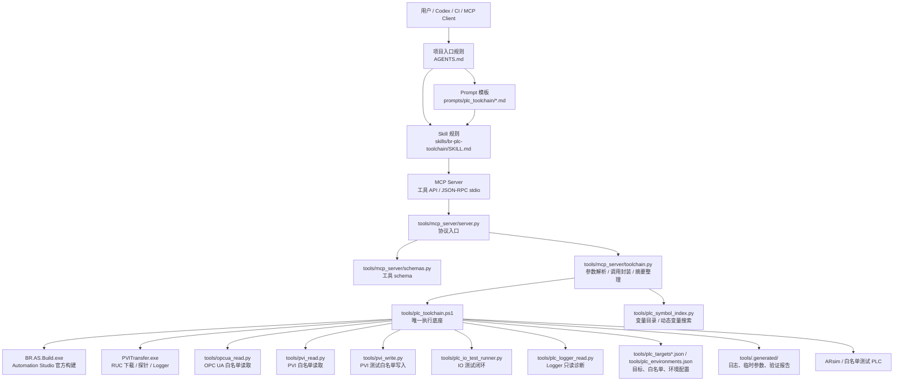

# PLC 工具链调用层级与模块说明

本文档解释本项目中 `AGENTS.md`、MCP Server、Skill、Prompt、本地 CLI、B&R 官方工具和项目模块之间的调用关系。它的重点不是复述每个脚本的实现细节，而是回答三个问题：

1. 用户、Codex、CI 或 MCP 客户端发起任务后，调用会按什么层级向下传递。
2. `AGENTS.md`、MCP、Skill、Prompt 分别负责什么，彼此之间是什么关系。
3. 当前项目已经拥有的自动化工具链模块和 PLC 工程模块有哪些。

## 总体分层



核心原则：**`AGENTS.md` 是 Agent 进入项目后的第一层约束；Skill 和 Prompt 不执行 PLC 逻辑，MCP Server 也不重新实现 PLC 逻辑；真实执行统一落到 `tools/plc_toolchain.ps1`，再由它调用 Automation Studio、PVITransfer、OPC UA/PVI Python 工具。**

## 各层职责

| 层级 | 代表文件 | 主要职责 | 不负责什么 |
|---|---|---|---|
| 项目入口规则 | `AGENTS.md` | 给 Codex/Agent 的项目级上岗须知：声明项目类型、强制前置阅读、指定 Skill、规定安全红线和标准闭环 | 不作为可复用任务模板，不执行具体工具 |
| Prompt | `prompts/plc_toolchain/*.md` | 提供可复用任务入口，例如构建验证、下载前检查、功能修改闭环、下载失败诊断 | 不保存长期规则，不执行命令 |
| Skill | `skills/br-plc-toolchain/SKILL.md` 和 `references/*.md` | 告诉 Agent 何时使用该工具链、必须遵守哪些顺序和安全边界 | 不封装底层工具，不复制脚本实现 |
| MCP Server | `tools/mcp_server/server.py` | 提供 stdio JSON-RPC MCP 协议入口，处理 `initialize`、`tools/list`、`tools/call` | 不直接操作 PLC |
| MCP Schema | `tools/mcp_server/schemas.py` | 定义 MCP 工具名、参数 schema、`execute=true` 等显式安全参数 | 不执行命令 |
| MCP Wrapper | `tools/mcp_server/toolchain.py` | 解析环境参数，调用 PowerShell CLI，整理 JSON 返回、日志路径、警告、下一步建议 | 不绕过 CLI 直接调用 B&R 工具 |
| 本地 CLI | `tools/plc_toolchain.ps1` | 项目内唯一执行底座：构建、启动 ARsim、探针、安全检查、下载、验证、报告 | 不承担 Agent 策略判断 |
| 官方/协议工具 | `BR.AS.Build.exe`、`PVITransfer.exe`、OPC UA/PVI 脚本 | 执行真实构建、下载、读取、写入测试变量、Logger 抓取 | 不理解 Agent 任务语义 |
| 配置和报告 | `tools/plc_targets*.json`、`tools/plc_environments.json`、`tools/.generated/*` | 目标配置、白名单、环境切换、日志和报告归档 | 不发起动作 |

## AGENTS.md、Prompt、Skill、MCP 的关系

`AGENTS.md`、Prompt、Skill、MCP 是四种不同层次的约束和工具：

- **`AGENTS.md` 是项目入口规则**：当 Agent 进入本仓库时，它先声明本工程是 B&R Automation Studio 项目，并要求在处理构建、下载、调试、PVI/OPC UA 验证前先阅读指定文档和加载 `br-plc-toolchain` Skill。
- **Prompt 是任务模板**：例如“构建并验证 ARsim”或“只做下载前安全检查”。它给人或 Agent 一个标准提问格式。
- **Skill 是操作规程**：当任务涉及 B&R AS 工程、构建、下载、ARsim、OPC UA/PVI 验证时，Agent 应先读 Skill 和其 reference，按安全流程执行。
- **MCP 是可调用接口**：MCP Client 或 Agent 真正调用的工具入口，例如 `plc_build_project`、`plc_check_download`、`plc_verify_opcua`。

典型关系如下：

```text
Agent 进入仓库并读取 AGENTS.md
-> AGENTS.md 指定前置文档、Skill、安全规则和标准闭环
-> 用户选择或书写 Prompt
-> Prompt 要求使用 br-plc-toolchain Skill
-> Skill 规定安全顺序和工具选择
-> Agent 调用 MCP 工具
-> MCP 工具转调 tools/plc_toolchain.ps1
-> CLI 调用 B&R 官方工具 / Python 脚本
-> 返回 JSON、日志路径、报告路径和下一步建议
```

## MCP Server 当前工具清单

当前 `tools/mcp_server/schemas.py` 和 `tools/mcp_server/toolchain.py` 中已经暴露 20 个 MCP 工具。早期规划中提到的“第一批 8 个工具”仍是基础闭环，但现在项目已经扩展到 Logger、PVI 写入、IO 测试、环境管理和 Agent 动态变量搜索。

| MCP 工具 | 对应 CLI/实现 | 类型 | 说明 |
|---|---|---|---|
| `plc_build_project` | `Build` | 构建 | 构建 Automation Studio 工程，可选生成 RUC 包 |
| `plc_start_arsim` | `StartArsim` | 仿真 | 启动或复用 ARsim |
| `plc_probe_target` | `Probe` | 只读 | 读取 CPU、AR 版本、PLC 状态 |
| `plc_describe_ruc_package` | `DescribePackage` | 只读 | 读取 RUC 包元信息 |
| `plc_check_download` | `CheckDownload` | 只读安全检查 | 比较包和目标，判断是否允许下载；用户授权后可对 ARsim 使用 `force_arsim_download=true` |
| `plc_download_ruc` | `Download` | 下载 | 需要 `execute=true`，并在 CLI 层再次做安全检查；ARsim 强制模式只允许 `role=arsim` |
| `plc_verify_opcua` | `VerifyOpcUa` | 只读验证 | 读取 OPC UA 白名单节点 |
| `plc_read_pvi` | `ReadPvi` | 只读验证 | 读取 PVI 白名单变量 |
| `plc_list_variables` | `tools/plc_symbol_index.py` | 只读变量目录 | 扫描工程变量并生成变量 catalog |
| `plc_search_variables` | `tools/plc_symbol_index.py` | 只读变量搜索 | Agent 按名称、模块、读写权限搜索变量 |
| `plc_read_logger` | `ReadLogger` | 只读诊断 | 读取白名单 PLC/AR Logger 模块 |
| `plc_write_pvi` | `WritePvi` | 测试写入 | 默认只允许写 `pvi.write_whitelist`；`agent_directed` 模式允许策略内动态写入 |
| `plc_run_arsim_closed_loop` | `RunArsimClosedLoop` | 组合流程 | 构建、启动 ARsim、探针、安全检查、可选下载、验证并写报告 |
| `plc_run_verification_suite` | `RunVerificationSuite` | 组合验证 | OPC UA 优先，PVI 备用，输出统一报告 |
| `plc_run_io_test_case` | `RunIoTestCase` | IO 测试 | 执行单个测试用例：reset、写入、等待、读回、断言、restore |
| `plc_run_test_suite` | `RunTestSuite` | IO 测试 | 批量执行测试套件并输出报告 |
| `plc_reset_test_harness` | `ResetTestHarness` | 测试恢复 | 按 `pvi.restore_writes` 恢复测试 harness |
| `plc_get_target_config` | `GetTargetConfig` | 只读配置 | 读取指定目标配置和白名单 |
| `plc_list_targets` | `ListTargets` | 只读配置 | 列出目标、IP、安全角色和自动下载权限 |
| `plc_list_environments` | MCP 层直接读取 `tools/plc_environments.json` | 只读配置 | 列出可用环境；该工具不经过 `plc_toolchain.ps1` |

## 标准调用流程

### 1. ARsim 构建下载验证闭环

```text
确认实际 AS config 和 Simulation 设置
-> plc_build_project(build_ruc_package=true)
-> plc_start_arsim
-> plc_probe_target
-> plc_describe_ruc_package
-> plc_check_download
-> plc_download_ruc(execute=true)
-> plc_verify_opcua
-> 如果 OPC UA 失败，再用 plc_read_pvi 备用验证
```

也可以使用组合工具：

```text
plc_run_arsim_closed_loop(execute=true)
```

注意：组合工具内部仍保留下载安全门。没有 `execute=true` 时只会完成构建、检查和报告，不会实际下载。

如果 ARsim 探针 CPU/order 与 RUC 包元信息不一致，标准流程先检查 `PrintDemo/Physical/<config>/Hardware.hw` 中 `Simulation=1`，重新构建并确认包 runtime 为 AR Simulation。只有用户明确授权时，才对 `target=arsim` 使用：

```text
plc_check_download(force_arsim_download=true)
plc_download_ruc(execute=true, force_arsim_download=true)
```

该例外只适用于本机 ARsim。物理测试 PLC 和 production 目标仍按普通安全门拒绝跨类型或 CPU 不匹配下载。

### 2. 只读下载前安全检查

```text
plc_probe_target
-> plc_describe_ruc_package
-> plc_check_download
```

该流程不执行下载，适合检查 RUC 包、目标 CPU、Runtime 类型和安全角色是否匹配。

### 3. 反馈验证

```text
plc_verify_opcua
-> 如果失败，plc_read_pvi
```

也可以使用：

```text
plc_run_verification_suite
```

该组合工具会生成 `tools/.generated/reports/*_verification_<target>.json`。

### 4. IO 测试闭环

```text
plc_reset_test_harness(execute=true)
-> plc_run_io_test_case(execute=true)
或 plc_run_test_suite(execute=true)
-> 自动执行 restore/reset
-> 输出 IO 测试报告
```

IO 测试只允许写入 `tools/plc_targets.local.json` 中 `pvi.write_whitelist` 定义的测试 harness 变量，不允许写 Safety、物理 I/O、系统变量或生产目标。

在 `access_policy.mode=agent_directed` 时，Agent 可以先调用 `plc_search_variables` 搜索输入/输出变量，再动态生成测试用例或直接调用 `plc_write_pvi` / `plc_read_pvi`。即使在该模式下，生产目标、Safety/物理 I/O/system 名称、缺少 `execute=true` 的写入仍会被拒绝。

动态 PVI 写入的推荐闭环是：

```text
plc_search_variables / plc_list_variables
-> plc_read_pvi 读取 before 和数据类型
-> plc_write_pvi(execute=true) 优先写同值
-> plc_read_pvi 独立读回
```

这样可以证明 Agent 可以自行选择变量并完成读写，同时尽量不改变控制状态。

### 5. Logger 只读诊断

```text
plc_read_logger(
  target="test_plc",
  logger_type="System",
  logger_name="$arlogsys",
  format=".html"
)
```

Logger 读取只返回摘要和报告路径，不把大段 HTML/CSV 内容直接塞进 MCP 返回。允许模块由 `logger.allowed_modules` 控制，Safety logger 默认被 `logger.blocked_modules` 禁用。

## 安全门位置

安全机制不是只放在某一层，而是多层防护：

| 安全点 | 所在层 | 说明 |
|---|---|---|
| 项目级安全红线 | `AGENTS.md` | 禁止生产 PLC 自动下载，要求优先 ARsim/测试 PLC，要求先读工具链文档和 Skill |
| 任务触发前读 Skill | Skill | 要求先理解安全边界和标准流程 |
| `execute=true` | MCP schema / wrapper / CLI | 下载、PVI 写入、IO 测试、reset 必须显式执行 |
| 变量访问模式 | `access_policy` | `whitelist` 默认只允许配置白名单；`catalog_policy` 使用变量目录；`agent_directed` 允许 Agent 动态选择变量 |
| 生产目标拒绝 | CLI 和工具脚本 | `role=production` 目标不自动下载或写入 |
| 包-目标匹配 | `CheckDownload` / `Download` | ARsim 包和物理 PLC 包不能混用；`force_arsim_download` 只允许用户授权后的 ARsim 目标 |
| 读取策略 | OPC UA/PVI 配置和 `access_policy` | 默认白名单读取；动态读取必须由用户显式切换模式 |
| 写入策略 | `pvi.write_whitelist` 和 `access_policy` | 默认只允许测试 harness；动态写入仍受黑名单和目标角色约束 |
| Logger 白名单 | `logger.allowed_modules` / `blocked_modules` | Logger 只读，Safety logger 默认拒绝 |
| Safety 工程保护 | Skill / 人工流程 | 不自动修改 Safety 工程、安全任务、安全 I/O |

## 当前配置与目标模块

### 环境配置

- `tools/plc_targets.local.json`：当前本地目标、工具路径、OPC UA/PVI/Logger 白名单。
- `tools/plc_targets.cwj_as6_x3687x.json`：另一个本地 AS6 + `x3687x` 环境目标配置。
- `tools/plc_environments.json`：MCP 环境映射，支持通过 `environment` 一键切换默认 `project_path`、`config`、`target`、`targets_path`。

当前环境包括：

| 环境 | 说明 |
|---|---|
| `default` | 使用 `tools/plc_targets.local.json`，默认 config 为 `x1685` |
| `cwj_as6_x3687x` | 使用 `x3687x` ARsim 环境和 `tools/plc_targets.cwj_as6_x3687x.json` |
| `cwj_test_plc_x1685` | 面向 `192.168.50.222` 物理测试 PLC，config 为 `x1685` |

`tools/plc_targets*.json` 还包含 `access_policy`。工具链的保守默认值为：

```json
{
  "mode": "whitelist",
  "allow_dynamic_pvi_read": false,
  "allow_dynamic_pvi_write": false,
  "allow_dynamic_opcua_read": false
}
```

实际运行时必须读取当前 `tools/plc_targets.local.json` 或传入的 `targets_path` 判断模式；本地 default 配置可以被用户切换为 `agent_directed`。如果用户手动改为 `agent_directed` 并打开对应 `allow_dynamic_*` 开关，Agent 可以先搜索变量，再把白名单外变量传给读写工具尝试访问。该模式不会关闭 production、Safety/I/O/system、`execute=true` 等硬安全门。

PVI 动态变量失败要区分两类：

| 现象 | 判断 |
|---|---|
| MCP 返回 `access_policy`、目标角色或黑名单错误 | 策略拒绝 |
| PVI 返回 `Object not found` / `11033` | 策略可能已放行，但当前 ARsim/PLC 运行映像里没有该任务/变量对象，应重新确认 build/download |

### 当前目标

| 目标 | IP | 角色 | 说明 |
|---|---|---|---|
| `arsim` | `127.0.0.1` | `arsim` | ARsim 仿真目标 |
| `test_plc` | `192.168.50.222` | `dedicated_test_plc` | 白名单测试 PLC |
| `test_plc_233` | `192.168.50.233` | `dedicated_test_plc` | 历史/备用测试 PLC |

Automation Studio config 必须按项目真实名称处理。本项目当前可见 config 包括 `x1685` 和 `x3687x`，不要在自动化流程里写死 `Config1`。

## 当前项目已经拥有的模块

### 1. PLC 工程模块

| 模块 | 路径 | 说明 |
|---|---|---|
| AS 工程入口 | `PrintDemo/Huitong_FrontEval.apj` | B&R Automation Studio 工程 |
| 物理/仿真配置 | `PrintDemo/Physical/x1685`、`PrintDemo/Physical/x3687x` | 两套 CPU config，分别对应 X20CP1685 和 X20CP3687X |
| SVG 逻辑 | `PrintDemo/Logical/SVG` | SVG/前端交互相关 PLC 逻辑 |
| LQR 控制逻辑 | `PrintDemo/Logical/LQR` | LQR 测试和 IO 闭环重点模块 |
| Middleware | `PrintDemo/Logical/Middleware` | 中间层、HmiBridge、MidTrans 等 |
| mappView | `PrintDemo/Logical/mappView` 和 `PrintDemo/Physical/*/mappView` | B&R mappView 可视化配置 |
| Web 资源 | `PrintDemo/CFCARD/WEBROOT` | HTML、ASP、JS 和前端数据服务资源 |
| 全局变量/类型 | `PrintDemo/Logical/Global.var`、`Global.typ` | 工程级变量和类型 |

### 2. 自动化工具模块

| 模块 | 路径 | 说明 |
|---|---|---|
| 本地 CLI | `tools/plc_toolchain.ps1` | 统一执行入口 |
| PVITransfer wrapper | `tools/invoke_pvitransfer_silent.ps1` | 静默调用 PVITransfer |
| OPC UA 读取 | `tools/opcua_read.py` | OPC UA 白名单验证 |
| PVI 读取 | `tools/pvi_read.py` | PVI 白名单读取 |
| PVI 写入 | `tools/pvi_write.py` | 测试 harness 白名单写入 |
| IO 测试 runner | `tools/plc_io_test_runner.py` | 单用例/测试套件执行、断言和恢复 |
| Logger 读取 | `tools/plc_logger_read.py` | PVITransfer Logger 只读诊断 |
| 变量目录/搜索 | `tools/plc_symbol_index.py` | 扫描 PLC 变量，生成 `tools/.generated/plc_symbol_catalog.json`，供 Agent 动态选变量 |
| MCP Server | `tools/mcp_server/*` | MCP JSON-RPC 工具接口 |
| 目标配置 | `tools/plc_targets*.json` | 工具路径、目标、白名单、安全角色 |
| 环境配置 | `tools/plc_environments.json` | 多环境默认参数映射 |
| 测试套件 | `tests/plc/lqr_io_tests.json` | LQR IO 测试用例 |
| 生成物目录 | `tools/.generated/*` | 日志、临时 JSON、报告、logger 输出 |

### 3. Agent 支持模块

| 模块 | 路径 | 说明 |
|---|---|---|
| 项目入口规则 | `AGENTS.md` | Codex/Agent 进入项目后的强制说明：声明项目类型、前置阅读、Skill 加载、安全红线、MCP 标准闭环和 ARsim config 注意事项 |
| Skill | `skills/br-plc-toolchain/SKILL.md` | 触发条件、安全规则、标准流程 |
| Skill references | `skills/br-plc-toolchain/references/*.md` | safety、command-flow、verification 细则 |
| Prompt 模板 | `prompts/plc_toolchain/*.md` | 可复制的任务入口模板 |
| 工具链背景文档 | `docs/PLC_AUTOMATION_TOOLCHAIN_CONTEXT.md` | 总体目标和安全边界 |
| 实施计划 | `docs/PLC_TOOLCHAIN_IMPLEMENTATION_PLAN.md` | 里程碑、已验证事实和约束 |
| MCP/Skill/Prompt 路线图 | `docs/PLC_MCP_SKILL_PROMPT_ROADMAP.md` | 分层规划和历史推进记录 |
| Logger 测试报告 | `docs/PLC_LOGGER_READ_TEST_REPORT.md` | Logger 读取验证记录 |

## 返回数据关系

MCP Server 对外统一返回：

```json
{
  "ok": true,
  "tool": "plc_probe_target",
  "target": "arsim",
  "summary": "X20CP1685 / 6.5.1 / WarmStart",
  "data": {},
  "logs": [],
  "warnings": [],
  "next_actions": []
}
```

其中：

- `data` 是 CLI 或脚本返回的原始结构化数据。
- `summary` 由 `tools/mcp_server/toolchain.py` 根据命令类型生成，方便 Agent 快速判断状态。
- `logs` 收集构建日志、PVITransfer 日志、报告路径、Logger 输出路径等。
- `warnings` 聚合失败原因、错误摘要或脚本警告。
- `next_actions` 给出下一步建议，例如构建成功后建议描述 RUC 包并检查下载，OPC UA 失败后建议尝试 PVI。

## 维护建议

1. 新增真实执行能力时，优先扩展 `tools/plc_toolchain.ps1`，再通过 MCP wrapper 暴露；不要让 MCP 绕过 CLI 直接操作 PLC。
2. 新增 MCP 工具时，同时更新 `tools/mcp_server/schemas.py`、`tools/mcp_server/toolchain.py`、本说明文档和相关 Skill reference。
3. 新增写入能力时，必须先设计白名单、restore/reset、报告和 `execute=true` 门控。
4. 新增 Prompt 时，只写任务入口和期望输出，不复制底层实现细节。
5. 新增 Skill 内容时，保持“规则和流程”层级，不把长脚本或易过期路径塞入 Skill。
6. 涉及 ARsim config 时，始终读取真实 config 名称和实际生成的 loader 路径，不写死 `Config1`、`x1685` 或 `x3687x`。
